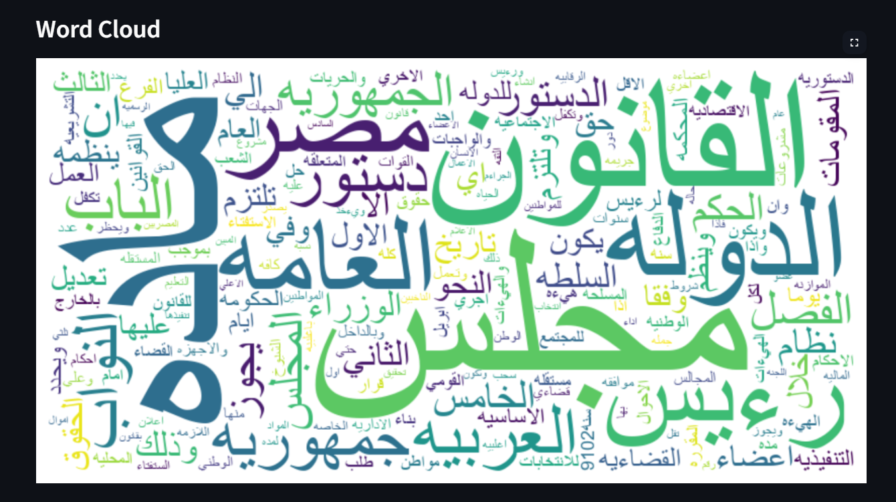

# Nasiy

Nasiy is a project aimed at simplifying information and facilitating access to knowledge in an innovative way. Nasiy provides AI-powered tools for text analysis, information extraction, and delivering accurate answers and comprehensive summaries.

<p align="center">
  
</p>

## Contributors

- [Moatasem Mohammed](https://github.com/moatasem75291)
- [Youmna Nabil](https://github.com/youmna-nabil)

## Features

- **Extract Text and Images from PDF Files**: Using the [`PDFExtractor`](pdf_processing/pdf_extractor.py), you can extract text and images from PDF pages.
- **Text Analysis**: Analyze texts using tools like word cloud generation and statistical analysis.
- **Chat with PDF Content**: An interactive user interface to chat with the content of PDF files using AI.
- **Record and Transcribe Audio**: Record audio and transcribe it to text using the Hugging Face API.





## Requirements

- Python 3.8 or later
- Python libraries listed in [`requirements.txt`](requirements.txt)

## Installation

1. Clone the repository:

   ```sh
   git clone https://github.com/moatasem75291/nasiy.git
   cd nasiy
   ```

2. Create and activate a virtual environment:

   ```sh
   python -m venv venv
   source venv/bin/activate  # On Windows: venv\Scripts\activate
   ```

3. Install the requirements:

   ```sh
   pip install -r requirements.txt
   ```

4. Set up environment variables:

   Create a `.env` file in the root of the project and add the appropriate values:

   ```env
   GOOGLE_API_KEY_SUMMARIZATION=YOUR_GOOGLE_API_KEY_SUMMARIZATION
   GOOGLE_API_KEY=YOUR_GOOGLE_API_KEY
   FAISS_INDEX_PATH=faiss_index
   HUGGINGFACE_URL_MODEL=https://api-inference.huggingface.co/models/openai/whisper-large-v3-turbo
   HUGGINGFACE_API=YOUR_HUGGINGFACE_API_KEY
   ```

## Usage

1. Run the application:

   ```sh
   streamlit run app.py
   ```

2. Upload a PDF file through the interactive user interface.

3. Choose the appropriate page (Analysis, Chat with PDF, About).

## Project Structure

- `pdf_processing/`: Contains tools for extracting text and images from PDF files.
- `text_processing/`: Contains tools for text processing and creating vector stores.
- `chatbot/`: Contains tools for chatting with PDF content.
- `design/`: Contains the interactive user interface.
- `summarization/`: Contains tools for summarizing PDF content.

## Contribution

We welcome contributions from everyone. To start contributing, please follow these steps:

1. Clone the repository and create a new branch:

   ```sh
   git checkout -b feature/feature-name
   ```

2. Make the necessary changes and push them to the new branch:

   ```sh
   git add .
   git commit -m "Add new feature"
   git push origin feature/feature-name
   ```

3. Open a Pull Request from the new branch to the main branch.

## License

This project is licensed under the [MIT License](LICENSE).
